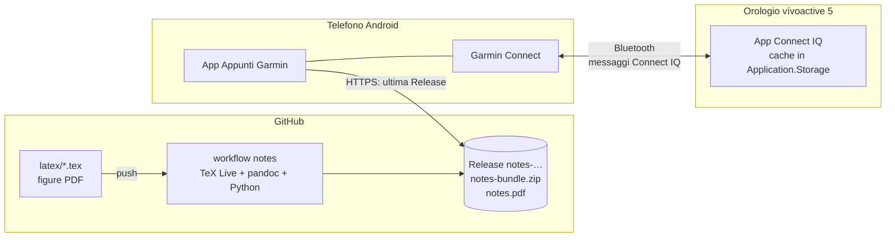

# Appunti LaTeX sul Garmin vívoactive 5

Questa repository trasforma gli appunti LaTeX della cartella [`latex/`](latex/) in
un formato leggibile sull'orologio **Garmin vívoactive 5** (schermo rotondo AMOLED
390×390) e li porta al polso tramite il telefono Android.

È composta da tre parti, compilate da GitHub Actions e indipendenti tra loro:

| Parte | Cartella | Cosa fa | Workflow |
|---|---|---|---|
| Pipeline di conversione | [`pipeline/`](pipeline/) | LaTeX → PDF di riferimento + `notes-bundle.zip` | `notes` |
| App Android | [`android/`](android/) | scarica il bundle dalle Release e lo passa all'orologio | `android` |
| App Connect IQ | [`garmin/`](garmin/) | mostra gli appunti sull'orologio | `garmin` |

In [`shared/`](shared/) ci sono i "contratti" comuni: formato del bundle
([`FORMAT.md`](shared/FORMAT.md)), protocollo orologio↔telefono
([`PROTOCOL.md`](shared/PROTOCOL.md)), font e UUID dell'app.

**Aggiornare gli appunti non richiede di ricompilare né reinstallare nessuna app**:
basta fare push delle modifiche in `latex/`.

---

## Indice

1. [Come funziona](#come-funziona)
2. [Installazione passo-passo](#installazione-passo-passo)
   1. [Cosa serve](#1-cosa-serve)
   2. [Configurare i secrets di GitHub](#2-configurare-i-secrets-di-github)
   3. [Prima compilazione e Release](#3-prima-compilazione-e-release)
   4. [Installare l'app Android](#4-installare-lapp-android)
   5. [Installare l'app sull'orologio](#5-installare-lapp-sullorologio)
   6. [Prima sincronizzazione](#6-prima-sincronizzazione)
3. [Usare l'app sull'orologio](#usare-lapp-sullorologio)
4. [Aggiornare gli appunti](#aggiornare-gli-appunti)
5. [Se qualcosa viene convertito male](#se-qualcosa-viene-convertito-male)
6. [Sviluppo locale](#sviluppo-locale)
7. [Risoluzione dei problemi](#risoluzione-dei-problemi)
8. [Limiti noti e cose da verificare sul dispositivo](#limiti-noti-e-cose-da-verificare-sul-dispositivo)
9. [Fonti](#fonti)

---

## Come funziona



Il flusso, dalla modifica alla lettura:

1. **Modifichi il LaTeX** in `latex/` e fai push.
2. Il workflow **`notes`** compila il documento con LaTeX (se c'è un errore vero la
   build fallisce e il log indica file e riga), lo converte e pubblica una
   **Release** `notes-AAAAMMGG…` con `notes-bundle.zip` e il PDF.
3. L'**app Android** controlla le Release (a mano o ogni 1/6/24 ore), scarica
   il bundle solo se è cambiato, verifica gli hash e lo tiene in cache.
4. Quando apri l'**app sull'orologio**, questa chiede al telefono la versione
   (`hello`). Se è cambiata scarica il nuovo indice; poi chiede solo le
   pagine e le immagini che ti servono, a pezzi da ~1,8 KB, e le tiene in cache.
   Senza telefono legge ciò che ha già in cache.

### La conversione in breve

- La pipeline trova da sola il documento principale (`\documentclass` +
  `\begin{document}`) e segue `\input`/`\include`. Capitoli e sezioni vengono
  dedotti **dalle macro stesse**: qui `\qgroup` contiene
  `\addcontentsline{toc}{section}` e diventa un capitolo, mentre `\question`
  contiene `\addcontentsline{toc}{subsection}` e diventa una sezione. Nessun nome
  di file o di capitolo è scritto nel codice.
- Il testo diventa testo vero, con la **matematica semplice in Unicode** e pochi
  stili: pedici, apici, vettori sottolineati, versori (^), derivate (˙). Le
  frazioni vanno in linea: `μ/(2a)`, `√(2μ/r)`. Il 99,5% delle formule inline
  di questi appunti resta testo.
- Le **equazioni** e le formule complesse (matrici, `\underset`, ...) sono
  compilate con LaTeX, usando lo stesso preambolo del documento, e diventano
  immagini a 4 livelli di grigio, bianco su nero. Quelle troppo larghe vengono
  spezzate automaticamente su righe, relazioni (=, ⇒, ...) e operatori.
- Le **figure** vengono ridimensionate per il cerchio. Quando sono piccole, c'è
  una versione ingrandita da esplorare col dito.
- Tutto viene **già impaginato per lo schermo rotondo**: righe più corte in alto
  e in basso, a capo con le metriche esatte dei font dell'orologio. L'orologio
  deve solo disegnare.
- Se qualcosa non si converte, non si blocca nulla: diventa un'immagine e finisce
  nel report (`report.md`, nella Release e nel riepilogo del workflow).

Perché pandoc e non LaTeXML o plasTeX: pandoc segue gli `\input`, espande le
`\newcommand`, trasforma gli ambienti sconosciuti (i 4 riquadri `tcolorbox`) in
blocchi con nome e **lascia la matematica come sorgente TeX**. È esattamente ciò
che serve per decidere formula per formula se usare testo o immagine. LaTeXML è
pesante, non supporta `tcolorbox` e restituisce MathML da riconvertire; plasTeX
è debole su `amsmath`. Dettagli in [`pipeline/README.md`](pipeline/README.md).

---

## Installazione passo-passo

### 1. Cosa serve

- Un telefono **Android 8 o successivo** con l'app **Garmin Connect** (Play Store)
  e l'orologio già associato a Garmin Connect. È obbligatoria: tutti i messaggi
  tra telefono e orologio passano da lì.
- Un **account Garmin solo per lo sviluppo, senza verifica in due passaggi**:
  serve alla CI per scaricare la definizione del vivoactive 5. Crealo su
  <https://developer.garmin.com/> (in alto a destra, *Sign in* → *Create one*).
- Un computer (Windows, macOS o Linux) con un cavo USB per l'orologio, per
  installare l'app la prima volta e quando la aggiorni.
- Per generare le chiavi, su un computer: **OpenSSL** e **keytool**, cioè un JDK.
  Su Windows li hai già installando *Git for Windows* (OpenSSL) e *Temurin JDK*
  (keytool). Su macOS e Linux OpenSSL c'è già; il JDK si installa con
  `brew install temurin` o `sudo apt install openjdk-17-jdk`.

### 2. Configurare i secrets di GitHub

I secrets sono valori segreti che GitHub passa ai workflow senza mostrarli nei log.

**Dove si mettono:** sulla pagina della repository su GitHub → **Settings** →
**Secrets and variables** → **Actions**.
- I *secrets* si aggiungono dalla scheda **Secrets** con **New repository secret**.
- La *variabile* si aggiunge dalla scheda **Variables** con **New repository variable**.

Riepilogo:

| Nome | Tipo | Serve a | Obbligatorio? |
|---|---|---|---|
| `GARMIN_USERNAME` | secret | login Garmin per scaricare i device file | per l'app orologio |
| `GARMIN_PASSWORD` | secret | idem | per l'app orologio |
| `CIQ_DEVELOPER_KEY_BASE64` | secret | firma dell'app orologio | per l'app orologio |
| `CIQ_AGREEMENT_HASH` | **variabile** | accettazione della licenza Connect IQ | per l'app orologio |
| `ANDROID_KEYSTORE_BASE64` | secret | firma dell'APK | no (senza: APK di debug) |
| `ANDROID_KEYSTORE_PASSWORD` | secret | password del keystore | con il keystore |
| `ANDROID_KEY_ALIAS` | secret | alias della chiave (es. `notes`) | con il keystore |
| `ANDROID_KEY_PASSWORD` | secret | password della chiave, se diversa | facoltativo |

Il workflow `notes` non ha bisogno di secrets.

#### 2a. Account Garmin

Crea i secrets `GARMIN_USERNAME` (l'email dell'account) e `GARMIN_PASSWORD`.
Se attivi la verifica in due passaggi su quell'account, il login dalla CI smette
di funzionare.

#### 2b. Chiave developer Connect IQ

È una chiave RSA che firma l'app dell'orologio. **Conservala**: per aggiornare
l'app serve la stessa chiave. In un terminale (su Windows: *Git Bash*):

```bash
openssl genrsa -out developer_key.pem 4096
openssl pkcs8 -topk8 -inform PEM -outform DER -in developer_key.pem -out developer_key.der -nocrypt
```

Convertila in base64 (una sola riga) e copia il risultato:

```bash
# Linux
base64 -w0 developer_key.der
# macOS
base64 -i developer_key.der | tr -d '\n'
```
```powershell
# Windows (PowerShell)
[Convert]::ToBase64String([IO.File]::ReadAllBytes("developer_key.der"))
```

Incolla la stringa nel secret `CIQ_DEVELOPER_KEY_BASE64`.

#### 2c. Licenza Connect IQ (variabile `CIQ_AGREEMENT_HASH`)

Per scaricare SDK e device bisogna accettare l'accordo di licenza Garmin. La CI
lo accetta solo se gli dai l'hash dell'accordo che hai letto. Se l'accordo cambia,
la CI si ferma e te lo segnala.

1. Dopo aver messo i secrets del punto 2a e 2b, avvia il workflow **garmin** a
   mano: scheda **Actions** → **garmin** → **Run workflow**.
2. Il job si ferma al passo *Licenza Connect IQ* e stampa l'indirizzo
   dell'accordo e una riga `Current Hash: 0123…`.
3. Leggi l'accordo. Se lo accetti, crea la **variabile** (o, in alternativa, il secret) `CIQ_AGREEMENT_HASH`
   con quel valore e rilancia il workflow.

#### 2d. Keystore Android (facoltativo ma consigliato)

Senza keystore la CI produce un APK di **debug**: funziona, ma non si può
aggiornare sopra un APK firmato con un'altra chiave. Con il keystore gli
aggiornamenti si installano sopra la versione precedente.

```bash
keytool -genkeypair -v -keystore notes-release.jks -alias notes \
        -keyalg RSA -keysize 4096 -validity 10000
```

Ti chiede una password e alcuni dati (nome, città…, puoi lasciarli vuoti).
**Conserva il file e la password**: se li perdi, per aggiornare l'app dovrai
disinstallarla. Poi convertilo in base64 come al punto 2b
(`base64 -w0 notes-release.jks`, ecc.) e crea i secrets:
- `ANDROID_KEYSTORE_BASE64` (il base64);
- `ANDROID_KEYSTORE_PASSWORD` (la password);
- `ANDROID_KEY_ALIAS` = `notes`.

`ANDROID_KEY_PASSWORD` serve solo se la chiave ha una password diversa da quella
del keystore. Con il formato PKCS12, quello predefinito di `keytool`, sono uguali.

### 3. Prima compilazione e Release

- **Appunti**: ogni push sul branch principale che tocca `latex/`, `pipeline/` o
  `shared/` pubblica una Release `notes-…`. Per forzarla: **Actions** → **notes** →
  **Run workflow**. Sugli altri branch il workflow gira lo stesso, ma pubblica
  solo gli *artifact* (anteprime PNG, report, bundle), senza Release.
- **App Android**: crea un tag `android-vX.Y.Z`, per esempio dal computer:
  ```bash
  git tag android-v1.0.0 && git push origin android-v1.0.0
  ```
  oppure da GitHub: **Releases** → **Draft a new release** → *Choose a tag*
  → scrivi `android-v1.0.0` → **Publish**. Il workflow allega l'APK alla Release.
- **App orologio**: come sopra, con un tag `garmin-vX.Y.Z`. Il workflow allega il
  `.prg` (da installare) e il `.iq` (per l'eventuale pubblicazione nello store).

Le versioni `0.x` (e i tag con `-alpha`/`-beta`) delle app vengono pubblicate come
*pre-release*. Le Release degli appunti non sono mai pre-release: l'app Android le
ignorerebbe.

Ogni build lascia comunque i file anche come *artifact*: **Actions** → apri
l'esecuzione → in fondo, sezione **Artifacts**.

### 4. Installare l'app Android

1. Sul telefono apri la pagina delle **Releases** della repository e scarica
   `appunti-garmin-….apk` dalla Release `android-v…` più recente.
2. Apri il file scaricato. La prima volta Android chiede di **consentire
   l'installazione da questa fonte** (il browser o l'app File): tocca
   *Impostazioni*, attiva *Consenti da questa fonte*, torna indietro e tocca
   *Installa*. Il percorso esatto dipende dal produttore; in genere è in
   *Impostazioni → App → Accesso speciale → Installa app sconosciute*.
3. Play Protect potrebbe avvisarti che l'app non è nota: scegli *Installa comunque*.
4. Apri **Appunti Garmin** e consenti le **notifiche**. Servono per la notifica fissa
   del servizio che risponde all'orologio in background e per l'avviso «nuovi
   appunti».
5. Premi **Controlla aggiornamenti**: l'app scarica il bundle dalla Release
   `notes-…` più recente.

Permessi usati: Internet (download), notifiche, servizio in primo piano, avvio
al boot (per riattivare il servizio). Non serve il Bluetooth: passa tutto da
Garmin Connect.

**Consiglio:** escludi l'app dall'ottimizzazione della batteria (*Impostazioni →
App → Appunti Garmin → Batteria → Senza restrizioni*), altrimenti alcuni produttori
chiudono il servizio e l'orologio non riceve più risposte.

### 5. Installare l'app sull'orologio

Le app per Connect IQ si possono installare copiando il file `.prg` (*sideload*):

1. Scarica `appunti-vivoactive5.prg` dalla Release `garmin-v…` più recente.
2. Collega l'orologio al computer con il cavo USB. L'orologio si presenta come
   dispositivo **MTP** (come un telefono), non come chiavetta:
   - **Windows**: compare in *Esplora file* come *vívoactive 5*. Apri
     *Internal Storage* → `GARMIN` → `Apps` e copia lì il file `.prg`.
   - **macOS**: macOS non legge l'MTP da solo. Installa
     [OpenMTP](https://openmtp.ganeshrvel.com/) (gratuito), aprilo con l'orologio
     collegato e trascina il `.prg` nella cartella `GARMIN/Apps`. Chiudi Garmin
     Express se è aperto, perché blocca l'accesso.
   - **Linux**: GNOME (Nautilus) e KDE (Dolphin) mostrano l'orologio
     nella barra laterale; in alternativa da terminale:
     ```bash
     gio mount -li | grep -i mtp       # trova l'indirizzo mtp://…
     gio copy appunti-vivoactive5.prg "mtp://<dispositivo>/Internal Storage/GARMIN/Apps/"
     ```
     oppure monta con `jmtpfs ~/garmin` e copia in `~/garmin/Internal Storage/GARMIN/Apps/`.
3. Scollega l'orologio (su macOS e Linux espellilo prima).

**Verifica:** dal quadrante premi il pulsante in alto a destra (*Attività e app*)
e scorri: deve comparire **Appunti LaTeX**. Se non c'è, ricollega l'orologio e
controlla che il file sia in `GARMIN/Apps`. Se l'orologio rifiuta l'app, il file
sparisce dalla cartella al riavvio successivo.

**Aggiornare l'app:** ripeti la copia sovrascrivendo il file. Gli appunti in
cache vengono conservati. Serve solo quando cambia l'app (tag `garmin-v…`),
**non** quando cambiano gli appunti.

> Alternativa: pubblicare l'app nello store Connect IQ come **beta privata**,
> caricando il file `.iq` su <https://apps.garmin.com/developer/>. Così si installa
> da Garmin Connect senza cavo. Non è necessario.

### 6. Prima sincronizzazione

1. Telefono: app Android aperta (o servizio attivo), bundle scaricato,
   orologio **Connesso** nella scheda *Orologio*.
2. Orologio: apri **Appunti LaTeX**. In alto compare «Sincronizzo 1/3…», poi
   l'elenco dei capitoli. Il primo accesso a una sezione la scarica; dopo è in
   cache (● accanto al numero di pagine).

---

## Usare l'app sull'orologio

| Dove | Gesto / pulsante | Azione |
|---|---|---|
| Elenchi | swipe su/giù | scorre |
| Elenchi | tocco su una voce (o pulsante in alto) | apre |
| Lettura | swipe su / pulsante in alto / tocco nella metà inferiore | pagina successiva |
| Lettura | swipe giù / tocco nella metà superiore | pagina precedente |
| Lettura | tocco su un'immagine con il triangolino verde | zoom |
| Zoom | swipe o trascinamento | sposta l'immagine |
| Ovunque | pulsante in basso | indietro |
| Ovunque | pressione prolungata sullo schermo (o il gesto *menu* del dispositivo) | menu: riprendi lettura, torna all'indice, sincronizza, svuota cache, mostra memoria |

In basso c'è il numero di pagina (`3/28`), sul bordo un arco con l'avanzamento
nella sezione. L'app ricorda dove eri arrivato (*Riprendi lettura*).

---

## Aggiornare gli appunti

1. Modifica o aggiungi file in `latex/`. I nuovi `.tex` vanno inclusi con
   `\input`/`\include` dal documento principale, come per il PDF.
2. Fai commit e push sul branch principale.
3. Il workflow `notes` pubblica una nuova Release. L'app Android la scarica al
   prossimo controllo (automatico o con il pulsante); l'orologio si aggiorna alla
   prossima apertura dell'app (o subito, se è aperta).

Solo le sezioni cambiate vengono riscaricate sull'orologio: ogni sezione ha il
suo hash.

Prima di fare push puoi controllare il risultato:
- nel riepilogo del workflow (**Actions** → esecuzione → *Summary*) c'è il report;
- negli **Artifacts** ci sono le **anteprime PNG** 390×390 di alcune sezioni,
  disegnate esattamente come sull'orologio.

---

## Se qualcosa viene convertito male

1. Apri il **report** (`report.md`, allegato alla Release e nel riepilogo del
   workflow). Elenca le formule rese come immagine, i comandi ignorati, i caratteri
   mancanti nel font e le formule che non compilano da sole.
2. Correggi con una regola in [`pipeline/rules.yaml`](pipeline/rules.yaml), senza
   toccare il LaTeX. Esempi:

   ```yaml
   # una macro che deve comparire diversamente sull'orologio
   macros:
     qref: {args: 1, body: 'Q.\,\ref{q:#1}'}

   # una macro di sezionamento non riconosciuta da sola
   structure:
     lezione: {level: section, args: 1, title: '#1'}

   # un ambiente (es. un diagramma) da mostrare come immagine
   image_envs: [mydiagram]

   # un simbolo matematico non previsto
   math_symbols:
     oneway: "→"
   ```
3. Fai push: il workflow rigenera il bundle. Non serve aggiornare le app.

Casi tipici:
- **Una macro custom compare come testo strano**: se è definita con
  `\newcommand` nel preambolo, pandoc la espande da solo. Se usa comandi interni
  (`\@…`), aggiungi una ridefinizione in `macros:`.
- **Un simbolo appare come `?`**: non è nel font dell'orologio. Nelle formule
  la pipeline passa da sola all'immagine. Per il testo normale, aggiungi il
  carattere a [`shared/font/charset.txt`](shared/font/charset.txt) e rigenera i
  font (`cd pipeline && python -m gwnotes.fontgen`). In questo caso va
  **ricompilata e reinstallata l'app orologio**: il font è compilato dentro l'app.
- **Un'equazione è troppo piccola**: ha la versione zoom (triangolino verde).
  Se capita spesso, aumenta `math_px_per_em` in `rules.yaml`.

---

## Sviluppo locale

### Pipeline

```bash
sudo apt install texlive-latex-extra texlive-fonts-recommended texlive-pictures latexmk pandoc poppler-utils
cd pipeline
pip install -r requirements.txt
python -m pytest -q tests
python -m gwnotes build --out ../dist --preview 10   # anteprime in ../dist/preview
```

Dettagli in [`pipeline/README.md`](pipeline/README.md).

### App orologio e simulatore

1. Installa il **Connect IQ SDK Manager** da
   <https://developer.garmin.com/connect-iq/sdk/>, accedi con l'account Garmin,
   scarica l'SDK e il dispositivo **vívoactive 5**.
2. Installa **Visual Studio Code** e l'estensione **Monkey C** (Garmin). Apri la
   cartella `garmin/` e usa *Monkey C: Build for Device* / *Run App*.
   Da terminale:
   ```bash
   monkeyc -f garmin/monkey.jungle -d vivoactive5 -o bin/appunti.prg -y developer_key.der
   connectiq &                       # avvia il simulatore
   monkeydo bin/appunti.prg vivoactive5
   ```
3. **Memoria**: nel simulatore *File → View Memory* mostra l'uso istantaneo. La
   console stampa righe `[mem] …` nei punti critici (avvio, font caricati, indice,
   ogni pagina, ogni immagine decodificata). Dal menu dell'app, *Mostra memoria*
   accende un indicatore sullo schermo.

### App Android

Android Studio (o solo l'SDK + JDK 17):

```bash
cd android
./gradlew testDebugUnitTest assembleDebug
adb install -r app/build/outputs/apk/debug/app-debug.apk
```

Un emulatore Android non ha Garmin Connect, quindi non può parlare con un orologio
vero. Si può però usare con il simulatore, vedi sotto.

### Provare la comunicazione telefono ↔ orologio senza orologio

Il simulatore Connect IQ può dialogare con l'app Android tramite ADB:

1. Telefono (o emulatore) collegato al PC con il *debug USB* attivo.
2. Nell'app Android: **Impostazioni → Simulatore Connect IQ** attivo.
3. Sul PC: `adb forward tcp:7381 tcp:7381`, da ripetere a ogni ricollegamento.
4. Avvia l'app nel simulatore e scegli **Connection → Start** (Ctrl+F1).

L'app dell'orologio nel simulatore chiede i dati all'app Android come farebbe
via Bluetooth. Fonte: *Communicating with Mobile Apps* nella documentazione Garmin.

---

## Risoluzione dei problemi

| Problema | Cosa fare |
|---|---|
| App Android: «Garmin Connect non è installato» | Installa Garmin Connect dal Play Store e associa l'orologio. |
| «Nessun orologio associato» | L'orologio va associato in Garmin Connect, non nelle impostazioni Bluetooth di Android. |
| Orologio «Non connesso» | Bluetooth attivo, orologio vicino, Garmin Connect aperto almeno una volta. Prova *Riavvia collegamento*. |
| «App sull'orologio non installata» | Copia il `.prg` (punto 5). Per le app installate via USB, Garmin Connect a volte non le rileva anche se funzionano: se l'orologio sincronizza, ignora il messaggio. |
| Orologio: «Telefono non raggiungibile» | App Android aperta o servizio attivo (notifica fissa), batteria senza restrizioni. Poi menu → *Sincronizza ora*. |
| Orologio: «Il telefono non ha ancora appunti» | Nell'app Android premi *Controlla aggiornamenti*. |
| Orologio: «Aggiorna l'app dell'orologio» | Bundle o font più nuovi dell'app: installa l'ultimo `.prg` (tag `garmin-v…`). |
| Sincronizzazione bloccata a metà | Menu → *Sincronizza ora*. Se persiste: menu → *Svuota cache*. Nel registro dell'app Android controlla gli errori. |
| Registro Android: «Messaggio troppo grande» | Riduci `chunk_bytes` in `pipeline/rules.yaml` (es. 1200) e fai push. |
| Orologio: errore di memoria / app che si chiude | Menu → *Mostra memoria* per vedere l'uso. Riduci `zoom_max` in `pipeline/gwnotes/profile.py`; in alternativa imposta `antialias` a `false` in `shared/font/fonts.json` (font a 1 bit, molto più leggeri) e ricompila l'app. |
| CI `notes`: «compilazione di main.tex fallita» | Errore LaTeX vero: il log riporta file e riga. Si riproduce anche con `latexmk` in locale. |
| CI `notes`: «I font generati non corrispondono» | Hai modificato `shared/font/charset.txt` o `fonts.json`: esegui `python -m gwnotes.fontgen` e fai commit dei file generati. |
| CI `garmin`: «Build Garmin saltata» | Mancano i secrets (punto 2). |
| CI `garmin`: «Licenza da accettare» / «accordo cambiato» | Punto 2c. |
| CI `garmin`: «Login Garmin fallito» | Credenziali sbagliate o verifica in due passaggi attiva sull'account. |
| CI `android`: «APK non firmato» | Mancano i secrets del keystore: viene prodotto un APK di debug (punto 2d). |
| Android: «l'app non è installata» quando aggiorni | APK firmati con chiavi diverse (es. debug → release): disinstalla e reinstalla. |

---

## Limiti noti e cose da verificare sul dispositivo

- **Compilazione dell'app orologio**: verificata in CI (SDK 9.2.0, vívoactive 5 con Connect IQ 5.2.0). Senza device file non si compila, e i
  device file richiedono il login Garmin. Il codice Monkey C viene verificato dalla
  CI solo dopo la configurazione dei secrets.
- **Dimensione dei messaggi**: Garmin non documenta un limite, ma l'SDK Android ha
  l'errore `FAILURE_MESSAGE_TOO_LARGE`. Il valore di 1800 byte per pezzo è
  prudente; si cambia in `rules.yaml` senza toccare le app.
- **Storage**: la documentazione Garmin si contraddice (8 KB/valore e 128 KB
  totali nella guida, 32 KB/valore e totale variabile nell'API reference). L'app
  usa pezzi da 1,8 KB, un budget di 96 KB e libera spazio se `setValue` fallisce.
  Gli appunti completi occupano più del budget (testo ~330 KB, immagini ~1,2 MB):
  in cache restano le sezioni lette di recente, il resto arriva dal telefono.
- **Memoria e prestazioni**: limite di 768 KB per le watch-app sul vivoactive 5.
  I font antialiasing (3 × 349 glifi) e le bitmap delle immagini (al massimo 4
  in memoria, zoom fino a 700×700) vanno misurati nel simulatore e sull'orologio
  vero con le righe `[mem]`.
- **Velocità del Bluetooth**: una sezione tipica sono 3–8 pezzi di testo più le
  immagini; il tempo reale va misurato.
- **App installate via USB e Garmin Connect**: lo stato «installata» potrebbe
  non essere riportato per un'app sideload; la messaggistica dovrebbe funzionare
  comunque.
- **Widget e glance**: non inclusi. La glance (ultima sezione letta, stato della
  sync) sarebbe un'aggiunta facile; il widget non serve perché la watch-app si
  apre dal menu *Attività e app*.

---

## Fonti

- Connect IQ Device Reference, vívoactive 5: schermo 390×390, 65.536 colori,
  touch, pulsanti enter/menu/esc; memoria watch-app 786.432 B, glance 65.536 B;
  font di sistema Roboto 32–63 px.
  <https://developer.garmin.com/connect-iq/device-reference/vivoactive5/>
- *Persisting Data* (guida Core Topics): «Keys and values are limited to 8 KB
  each, and a total of 128 KB of storage is available».
  <https://developer.garmin.com/connect-iq/core-topics/persisting-data/>
- API reference `Toybox.Application.Storage`: «values are limited to 32 KB»,
  limite totale variabile per dispositivo.
  <https://developer.garmin.com/connect-iq/api-docs/Toybox/Application/Storage.html>
- *Communicating with Mobile Apps* e *Mobile SDK for Android* (simulatore via ADB,
  porta 7381; Garmin Connect obbligatorio).
  <https://developer.garmin.com/connect-iq/core-topics/mobile-sdk-for-android/>
- Connect IQ Mobile SDK per Android 2.4.0 su Maven Central
  (`com.garmin.connectiq:ciq-companion-app-sdk`).
- Download dell'SDK: <https://developer.garmin.com/downloads/connect-iq/sdks/sdks.json>
  (pubblico); device file solo con login (API Garmin: HTTP 401 senza token).
- Licenza dell'SDK (`CIQ-LICENSE-AGREEMENT.html` nello zip dell'SDK), §3: vieta di
  ridistribuire o pubblicare l'SDK. Per questo i device file non sono nella repo.
- [connect-iq-sdk-manager-cli](https://github.com/lindell/connect-iq-sdk-manager-cli)
  v0.8.4: download di SDK e device in CI.
